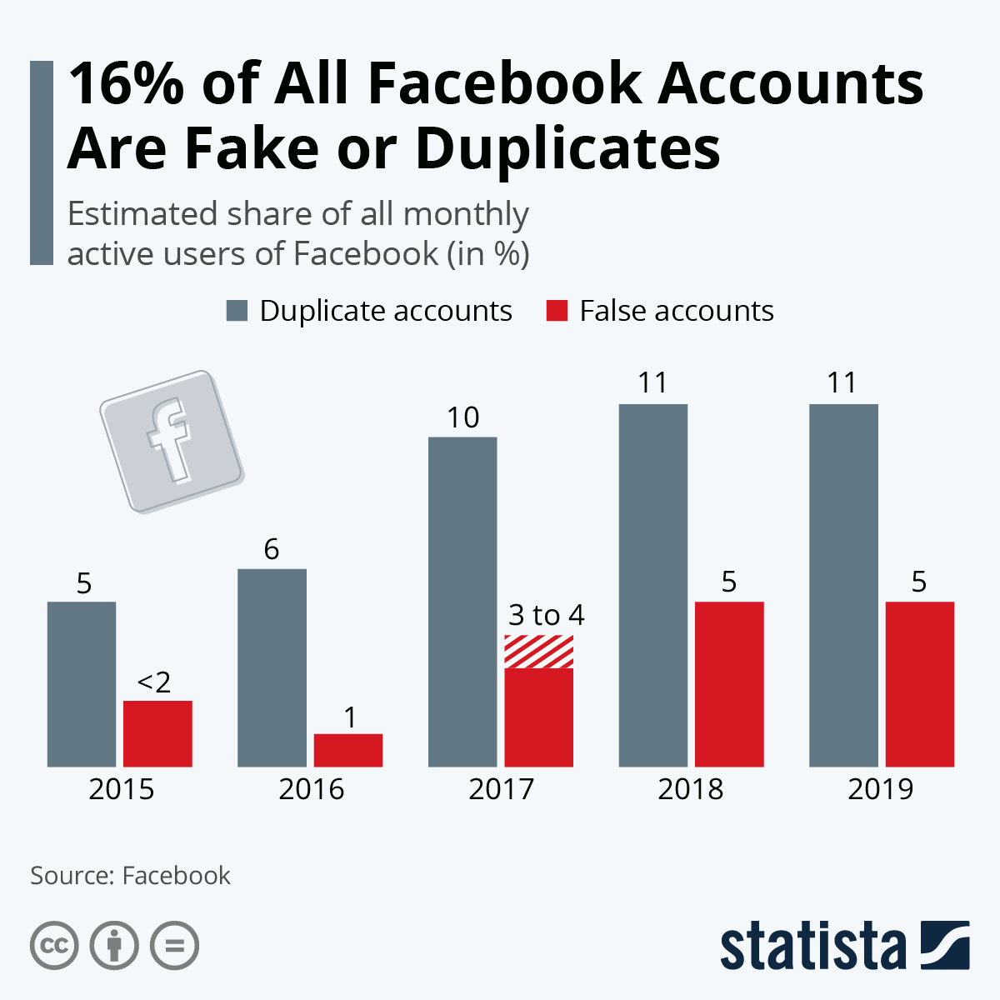
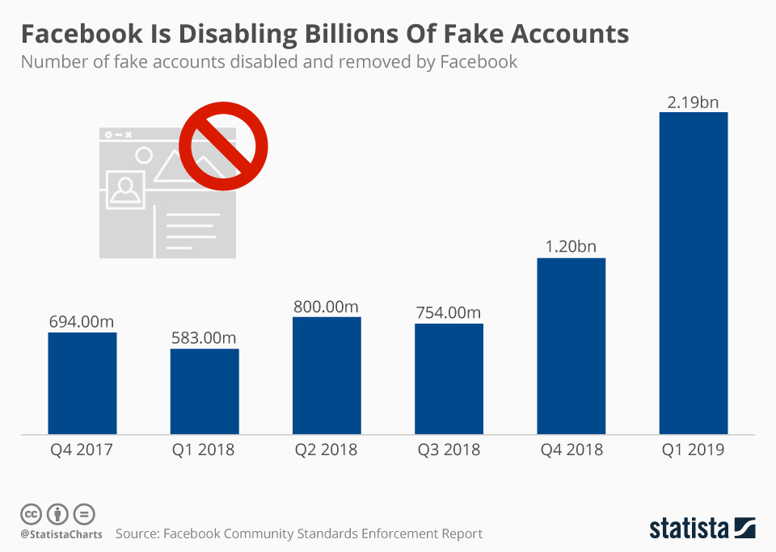
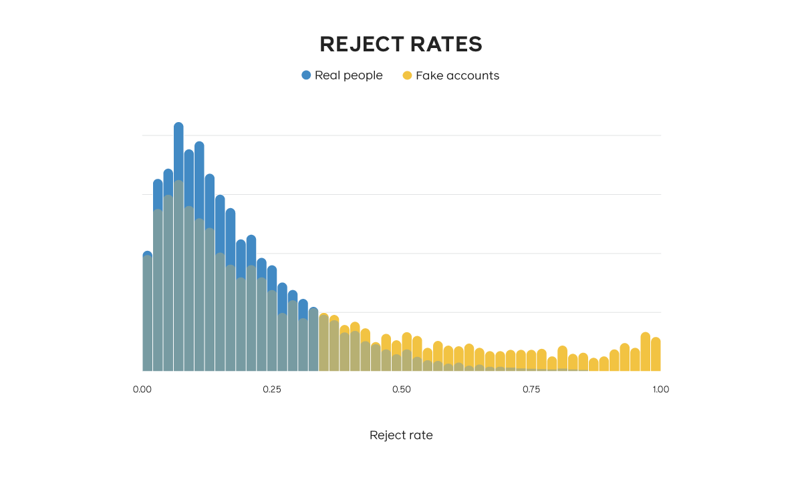
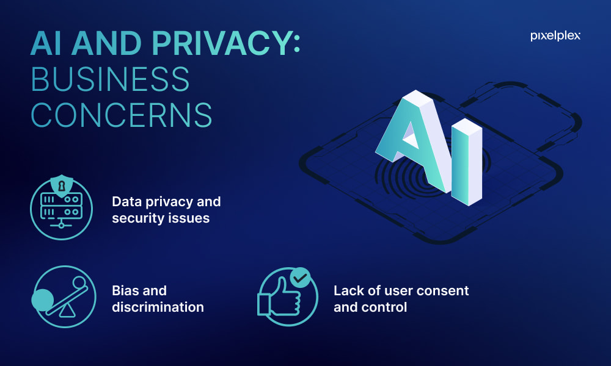
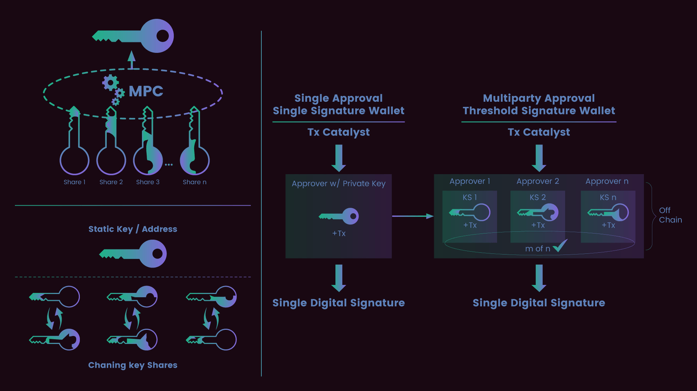
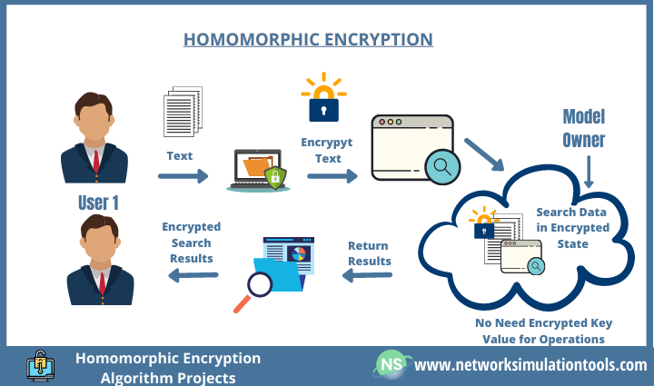
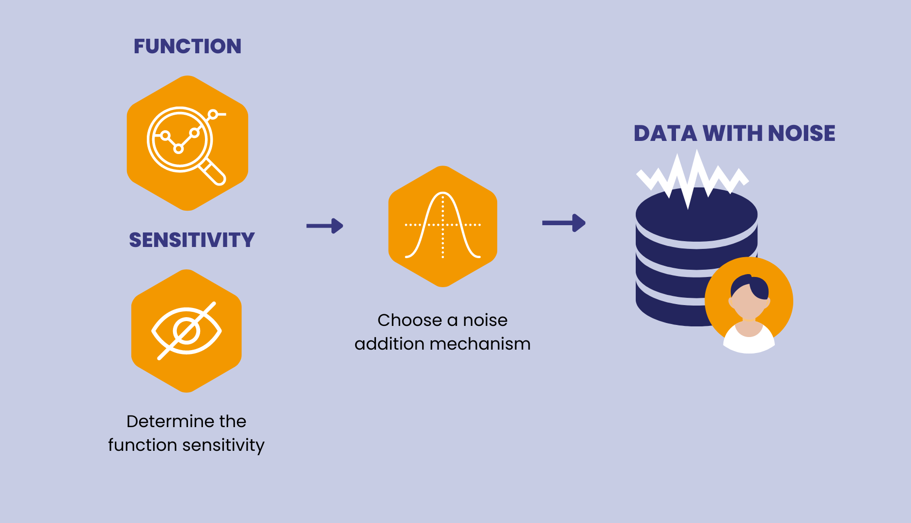

<link href="https://fonts.googleapis.com/icon?family=Material+Icons" rel="stylesheet">


```{r setup, include=FALSE}
knitr::opts_chunk$set(echo = TRUE)
library(distill)
library(rmarkdown)
```

## The Harm of Fake Accounts to Social Communities and Users

Social media platforms, particularly Facebook, have become breeding grounds for fake accounts. These accounts not only undermine user trust but also have far-reaching impacts on the entire social ecosystem.




### Exploiting Public Trust in Public Figures for Scams

- Celebrity Impersonation: Numerous fake accounts use photos and names of celebrities or internet personalities to lure users into joining investment groups, leading to fraudulent activities.
Misleading Information: These accounts disseminate false information, misleading users and potentially causing financial losses.
Erosion of Platform Trust

- Declining User Trust: Continuous scam activities have eroded trust in Facebook, resulting in a decrease in its user base.
Advertisers Withdrawal: Due to the trust crisis, advertisers have started to reduce their investments on the platform, further affecting its revenue.
Negative Impact on Online Environment


### Erosion of Platform Trust

- Declining User Trust: Continuous scam activities have eroded trust in Facebook, resulting in a decrease in its user base.

- Advertisers Withdrawal: Due to the trust crisis, advertisers have started to reduce their investments on the platform, further affecting its revenue.


### Negative Impact on Online Environment

- Bot Manipulation: A plethora of bot accounts manipulate discussions and sentiments on the platform, damaging the healthy online communication environment.

- False Feedback: Fake accounts provide misleading feedback, impairing the effectiveness of ad targeting and further harming the interests of advertisers and the platform.
Challenges and Strategies

## Facebook's Technological Approach to Combating Fake Accounts

Facebook, as a leading social media platform, has been at the forefront of combating the proliferation of fake accounts. Recognizing the detrimental impact these accounts have on user trust and platform integrity, Facebook has employed a multi-faceted technological strategy.




## Facebook's SybilEdge: A Technological Leap in Detecting Fake Accounts

Facebook's ongoing battle against fake accounts has led to the development of SybilEdge, an innovative algorithm designed to scrutinize the patterns of friend requests and responses on the platform. This tool represents a significant stride in Facebook's efforts to maintain the authenticity of its user base.

### Understanding SybilEdge

SybilEdge operates by analyzing the friend request targets selected by new users and their corresponding acceptance or rejection rates. This approach is grounded in the observation that fake accounts typically exhibit a higher rejection rate compared to genuine accounts. However, the challenge lies in the fact that not all requests from real users are accepted, and not all fake users are consistently rejected.




### The Two-Stage Process of SybilEdge

- Training the Model: Initially, Facebook observed data over a period, using outputs from behavioral classifiers that flagged accounts as abusive based on actual abuse. This phase helped in setting up the necessary model parameters.

- Real-Time Analysis: For each friend request and response (accept or reject), SybilEdge updates the probability of the requester being fake. This dynamic approach allows for a more nuanced and accurate detection of fake accounts.

### The Efficacy of SybilEdge

SybilEdge's effectiveness is evident in its ability to discern fake accounts with as few as 20 friend requests. This is achieved by leveraging the differences in how users respond to friend requests from real versus fake accounts. The algorithm's strength lies in its rapid classification, adversarial robustness, low complexity, interpretability, and robust training.

### Future Directions

Looking ahead, Facebook aims to further refine the detection of abusive accounts, making decisions faster and more confidently than what SybilEdge currently offers. This involves integrating feature-based and behavior-based models to enhance the platform's security.


## Image analysis

In the digital age, where visual content dominates social media, the authenticity of images has become a critical concern, especially in the context of fake accounts. Image analysis, leveraging advanced technologies like image recognition algorithms and reverse image search, plays a pivotal role in identifying and combating these fraudulent accounts. These technologies not only enhance the security of social media platforms but also preserve the integrity of online interactions.

Image recognition algorithms use deep learning and AI to scrutinize images for signs of manipulation or forgery. Meanwhile, reverse image search tools help in verifying the originality of profile pictures, detecting whether an image has been copied or reused, which is a common trait of fake accounts. Together, these tools form a formidable line of defense against the misuse of images in creating or sustaining fake online identities.


### Image Recognition Algorithm:

Description:

Advanced image recognition algorithms are pivotal in the fight against fake accounts. Utilizing deep learning and artificial intelligence, these algorithms scrutinize images to identify patterns indicative of forgery or manipulation. They play a crucial role in maintaining the authenticity of user profiles on social media platforms.

Working Principle:

- Detection of Anomalies: These algorithms are adept at spotting inconsistencies in images, such as unnatural lighting or distorted facial proportions, which are common in manipulated images.

- Pattern Recognition: They analyze the image's key features, comparing them against known patterns of forgery, to determine the authenticity of the image.

### Reverse Image Search:

Description:

Reverse image search is a powerful tool used by platforms to verify the originality of profile pictures. It helps in identifying whether an image has been copied from the internet, suggesting potential identity theft or the creation of a fake account.

Working Principle:

- Image Comparison: The tool compares the uploaded profile image against a vast database of images available on the internet.

- Identification of Duplicates: If the same image is found in multiple places, especially on different profiles, it raises a red flag about the genuineness of the account.


### Self-Reporting Mechanism:

- Description:

this is currently one of the most stable and effective ways to combat misuse. By establishing a reporting system and streamlining the reporting process, aided by AI-assisted review, the public is more willing to report violations. 

- Working Principle:

Platforms integrate machine learning and human review, with machine learning automatically sifting through a large volume of reports, while human review teams further scrutinize potential false profiles to enhance detection accuracy.

## Concern



### Privacy Concerns

Description:

The use of AI in scrutinizing user accounts raises significant privacy concerns. Users are increasingly wary about the extent to which their personal information, including images and interactions, is analyzed by AI systems. This apprehension stems from the fear of intrusive surveillance and misuse of personal data.

Implications:

- Trust Issues: Users may feel their privacy is being invaded, leading to a lack of trust in the platform.

- Data Security: Concerns about how securely the data is stored and who has access to it.

### Erroneous Blocking 

Description:

AI systems, while sophisticated, are not infallible. There is a risk of legitimate user accounts being incorrectly flagged as fake, leading to unwarranted blocking or restrictions.

Implications:

- User Inconvenience: Legitimate users may face the frustration of having their accounts restricted without valid reason.

- Appeal Process: The need for an efficient system to review and rectify such errors.

### Restriction and Freedom of Speech

Description:

The application of AI in monitoring content can inadvertently lead to excessive censorship. Overzealous filtering could suppress legitimate content, impacting users' freedom of speech.

Implications:

- Content Suppression: Legitimate expressions or discussions might be unfairly restricted.

- Balancing Act: Platforms need to find a balance between preventing abuse and preserving freedom of expression.

## Solutions


### De-identification Techniques

De-identification in AI involves methods to protect user privacy by ensuring that personal data cannot be traced back to an individual. This is crucial in maintaining user trust and complying with privacy regulations.

- Multi-Party Computation (MPC): This technique allows multiple parties to jointly compute a function over their inputs while keeping those inputs private. MPC is particularly useful in scenarios where sharing raw data is sensitive or risky.



- Homomorphic Encryption: This form of encryption enables computation on ciphertexts, generating an encrypted result that, when decrypted, matches the result of operations performed on the plaintext. It allows for data processing without exposing the actual data.



- Differential Privacy: This approach adds noise to the data or queries on the data to provide privacy guarantees. It ensures that the removal or addition of a single database item does not significantly affect the outcome of any analysis, thus masking the presence of individuals in a dataset.




### External Constraints

To ensure that AI technologies are used responsibly and ethically, external constraints are necessary. These include regulatory frameworks and oversight mechanisms.

- Regulatory Frameworks: Establishing laws and regulations that govern the use of AI, particularly in areas like data privacy, bias prevention, and ethical usage, is crucial. These frameworks provide guidelines and boundaries for AI development and deployment.

- Oversight by Third-Party Organizations and Internal Accountability Committees: Independent oversight bodies can monitor AI applications to ensure compliance with ethical standards and regulations. Similarly, internal committees within organizations can oversee AI projects to ensure they align with ethical guidelines and business values.


## Reference：

[fb關閉人臉識別技術](https://about.fb.com/news/2021/11/update-on-use-of-face-recognition/)

[圖像識別算法介紹](https://www.v7labs.com/blog/image-recognition-guide)

[去識別化資料](https://www.hhs.gov/hipaa/for-professionals/privacy/special-topics/de-identification/index.html)


