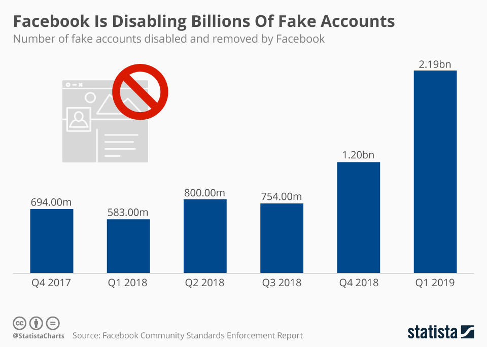
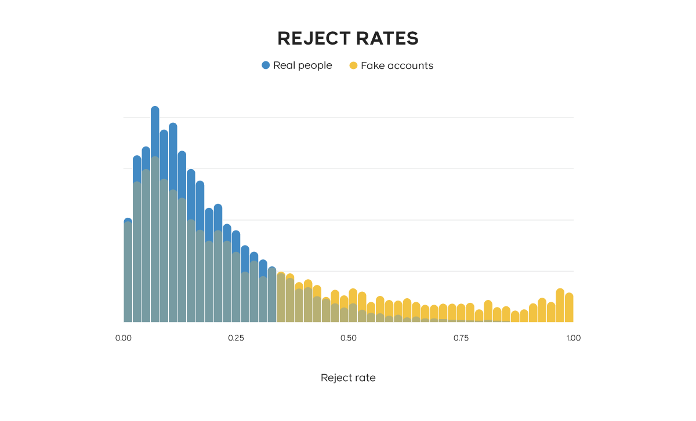
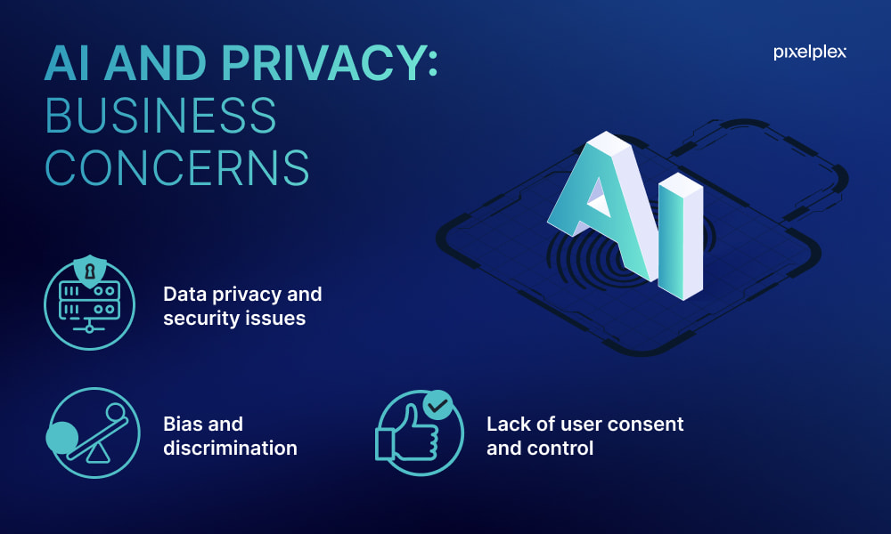
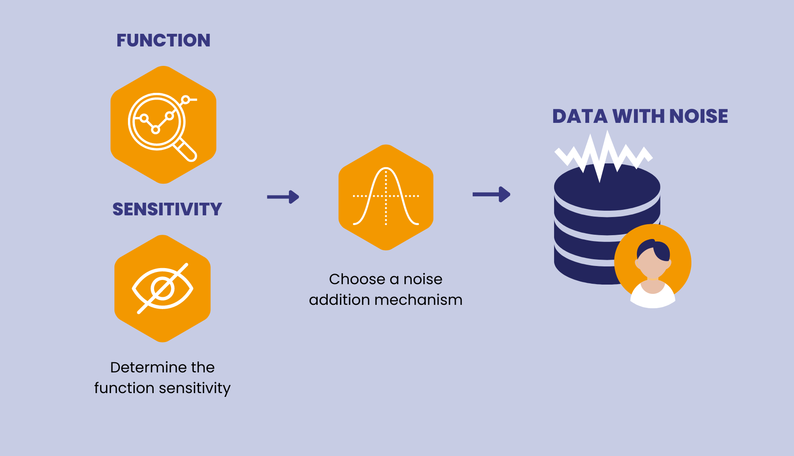

<link href="https://fonts.googleapis.com/icon?family=Material+Icons" rel="stylesheet">


```{r setup, include=FALSE}
knitr::opts_chunk$set(echo = TRUE)
library(distill)
library(rmarkdown)
```

## 假帳戶對社群與用戶所造成的影響

在社交媒體的世界中，尤其是在 Facebook，假帳戶的問題日益嚴重。這些帳戶不僅侵蝕了用戶的信任，更對整個社交生態造成了深遠的衝擊。


### 利用公眾對名人的信任進行詐騙

- 名人冒充：許多假帳戶使用名人或網絡紅人的照片和名字來吸引用戶加入投資群組，從而進行詐騙活動。

- 誤導信息：這些帳戶散播虛假信息，誤導用戶，可能導致經濟損失。

### 商業威脅


- 用戶信任下降：持續的詐騙活動已侵蝕了用戶對 Facebook 的信任，導致其用戶基數下降。

- 廣告商撤退：由於信任危機，廣告商開始減少在平台上的投資，進一步影響其收入。

### 對線上環境的負面影響

- 機器人操控：大量機器人帳戶在平台上操縱討論和情緒，損害健康的線上溝通環境。

- 虛假反饋：假帳戶提供誤導性反饋，損害廣告定位的有效性，進一步損害廣告商和平台的利益。


## Facebook 技術手段對抗假帳戶

作為領先的社交媒體平台，Facebook 一直處於對抗假帳戶泛濫的前沿。Facebook 認識到這些帳戶對用戶信任和平台完整性的負面影響，因此採用了多方面的技術策略。



## Facebook 的 SybilEdge：在檢測假帳戶方面的技術飛躍

Facebook 在對抗假帳戶的持續戰鬥中，開發出了 SybilEdge，這是一種創新算法，旨在審查平台上好友請求和回應的模式。這個工具代表了 Facebook 維護用戶基礎真實性方面的重大進步。

### 了解 SybilEdge

SybilEdge 通過分析新用戶選擇的好友請求目標及其對應的接受或拒絕率來運作。這種方法基於這樣的觀察：與真實帳戶相比，假帳戶通常有更高的拒絕率。然而，挑戰在於，並非所有真實用戶的請求都被接受，也不是所有假用戶都被一致拒絕。



### SybilEdge 的兩階段過程

- 訓練模型：最初，Facebook 觀察了一段時間的數據，使用基於實際濫用行為的行為分類器輸出來標記帳戶。這一階段有助於設置必要的模型參數。

- 實時分析：對於每一個好友請求和回應（接受或拒絕），SybilEdge 更新請求者是假帳戶的概率。這種動態方法允許更細緻和準確地檢測假帳戶。

### SybilEdge 的有效性

SybilEdge 的有效性在於其能夠以僅 20 個好友請求就識別出假帳戶。這是通過利用用戶對真實與假帳戶的好友請求反應差異來實現的。該算法的優勢在於其快速分類、對抗性堅固、低復雜度、可解釋性和堅實的訓練。

### 未來方向

展望未來，Facebook 旨在進一步完善檢測濫用帳戶的方法，使決策比 SybilEdge 目前提供的更快、更有信心。這包括整合基於特徵和基於行為的模型，以增強平台的安全性。

## 圖像分析

在數字時代，視覺內容主導社交媒體，圖像的真實性成為一個關鍵問題，特別是在假帳戶的背景下。利用先進技術，如圖像識別算法和反向圖像搜索，圖像分析在識別和對抗這些欺詐帳戶中扮演著關鍵角色。這些技術不僅增強了社交媒體平台的安全性，還保護了線上互動的完整性。

圖像識別算法利用深度學習和人工智能審查圖像，以尋找操縱或偽造的跡象。同時，反向圖像搜索工具幫助驗證個人資料圖片的原創性，檢測圖像是否被複製或重複使用，這是假帳戶的常見特徵。這些工具共同構成了一道強大的防線，對抗在創建或維持假線上身份時濫用圖像的行為。


### 圖像識別算法：

描述：

先進的圖像識別算法在對抗假帳戶的戰鬥中起著關鍵作用。這些算法利用深度學習和人工智能審查圖像，以識別表明偽造或操縱的模式。它們在維護社交媒體平台上用戶資料的真實性中扮演著至關重要的角色。

工作原理：

- 異常檢測：這些算法擅長發現圖像中的不一致性，如不自然的光線或扭曲的臉部比例，這些在操縱圖像中很常見。

- 模式識別：它們分析圖像的關鍵特徵，並將其與已知的偽造模式進行比較，以確定圖像的真實性。

### 反向圖像搜索：

描述：

反向圖像搜索是平台用來驗證個人資料圖片原創性的強大工具。它有助於識別圖像是否從互聯網複製，暗示潛在的身份盜用或假帳戶的創建。

工作原理：

- 圖像比較：該工具將上傳的個人資料圖片與互聯網上可用的大量圖像數據庫進行比較。

- 複製識別：如果在多個地方發現相同的圖像，特別是在不同的資料上，則會對帳戶的真實性提出質疑。

### 自我舉報機制：

- 描述：

這目前是對抗濫用最穩定和有效的方法之一。通過建立舉報系統並簡化舉報流程，輔以 AI 輔助審查，公眾更願意舉報違規行為。

- 工作原理：

平台結合機器學習和人工審查，機器學習自動篩選大量報告，而人工審查團隊進一步審查潛在的假資料，以提高檢測的準確性。


## 關注點



### 隱私擔憂

描述：

在審查用戶帳戶時使用 AI 引發了重大的隱私擔憂。用戶對他們的個人信息，包括圖像和互動，被 AI 系統分析的程度越來越警惕。這種憂慮源於對侵入式監視和個人數據濫用的恐懼。

影響：

- 信任問題：用戶可能會感覺他們的隱私被侵犯，導致對平台的不信任。

- 數據安全：對數據存儲的安全性以及誰能訪問這些數據的擔憂。

### 錯誤封鎖

描述：

雖然 AI 系統很先進，但並非萬無一失。合法用戶帳戶被錯誤標記為假帳戶的風險導致無故的封鎖或限制。

影響：

- 用戶不便：合法用戶可能會因帳戶無正當理由被限制而感到沮喪。

- 上訴流程：需要一個有效的系統來審查和糾正這些錯誤。

### 限制與言論自由

描述：

在監控內容中應用 AI 可能無意中導致過度審查。過度積極的過濾可能壓制合法內容，影響用戶的言論自由。

影響：

- 內容壓制：合法的表達或討論可能被不公平地限制。

- 平衡行為：平台需要在防止濫用和保護言論自由之間找到平衡。


## 解決方案

### 去識別化技術

在 AI 中進行去識別化涉及保護用戶隱私的方法，確保個人數據無法追溯到個人。這在維持用戶信任和遵守隱私法規中至關重要。

- 多方計算 (MPC)：這種技術允許多方在保持其輸入私密的同時共同計算一個函數。MPC 在分享原始數據敏感或風險的場景中特別有用。


- 同態加密：這種加密形式使得在密文上進行計算成為可能，生成的加密結果在解密後與對明文進行的操作結果相匹配。它允許進行數據處理而不暴露實際數據。


- 差分隱私：這種方法對數據或對數據的查詢添加噪聲，以提供隱私保障。它確保單個數據庫項目的刪除或添加不會顯著影響任何分析的結果，從而掩蓋數據集中個人的存在。



### 外部約束

為了確保 AI 技術負責任且道德地使用，必要的外部約束是必需的。這包括監管框架和監督機制。

- 監管框架：建立管理 AI 使用的法律和法規，特別是在數據隱私、偏見預防和道德使用等領域，至關重要。這些框架為 AI 的開發和部署提供了指導和界限。

- 第三方組織和內部問責委員會的監督：獨立的監督機構可以監控 AI 應用以確保符合道德標準和法規。同樣，組織內部的委員會可以監督 AI 項目，以確保它們與道德指導原則和商業價值保持一致。


## Reference：

[fb關閉人臉識別技術](https://about.fb.com/news/2021/11/update-on-use-of-face-recognition/)

[圖像識別算法介紹](https://www.v7labs.com/blog/image-recognition-guide)

[去識別化資料](https://www.hhs.gov/hipaa/for-professionals/privacy/special-topics/de-identification/index.html)


